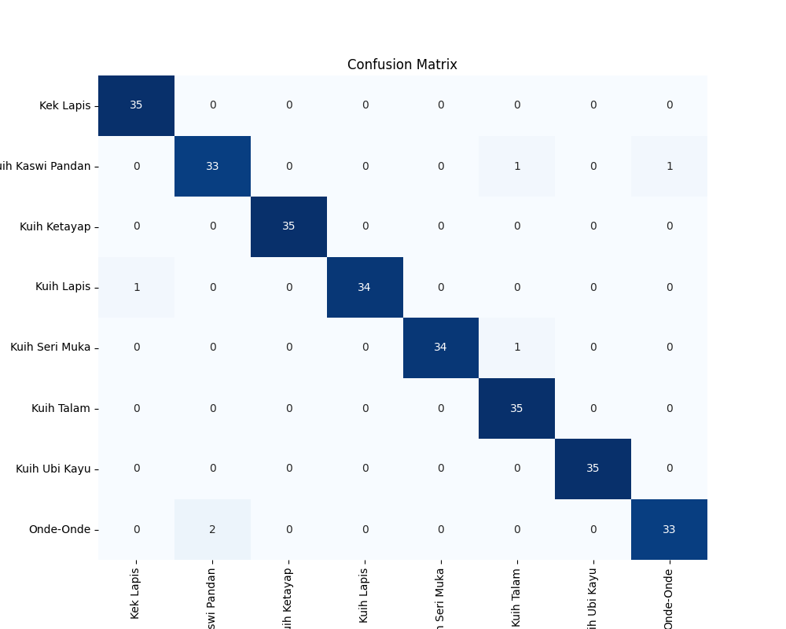
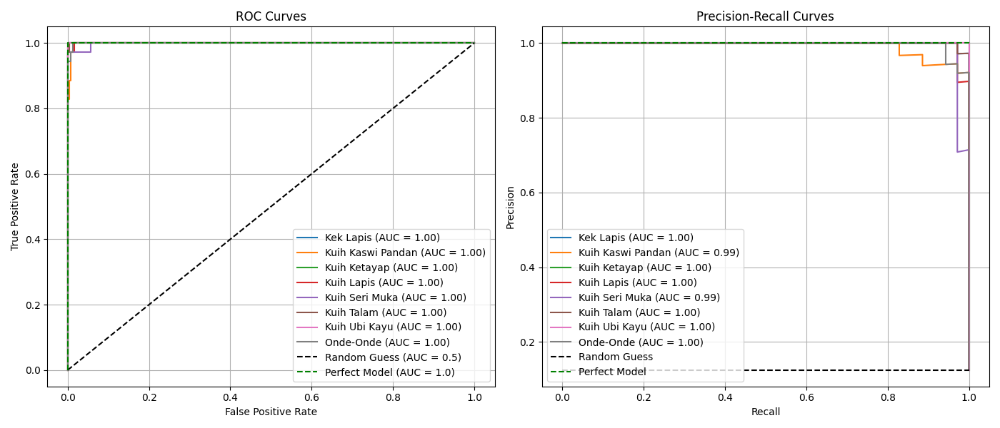
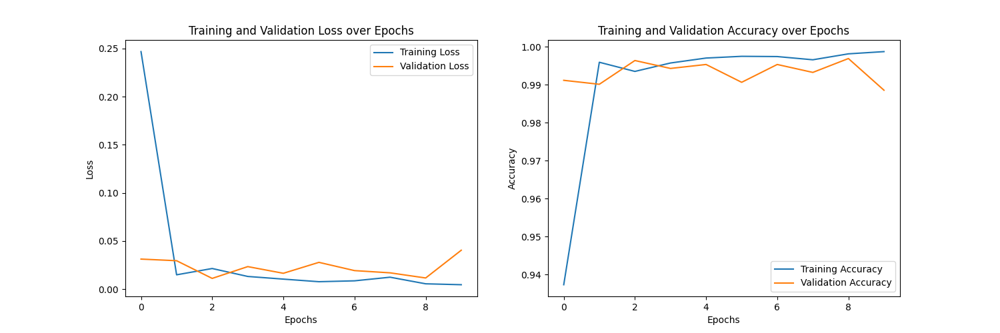

# 🍡 Kuih Classifier

> A deep-learning model that recognises **8 traditional Malaysian *kuih*** from a
> single photo — **97.9% macro-F1** on a held-out test set, using transfer
> learning on ResNet-50 with hyperparameters tuned by Bayesian Optimization.

### 🏆 2nd Runner-Up — National AI Competition (NAIC) 2024 · out of 60+ teams

Built for **NAIC 2024**, Senior Technical Track — organised by **Hyperbyte AI**,
sponsored by **Sunway University**. The problem statement: build an
image-classification model for 8 kuih. Every decision, every line of the
pipeline — data collection, augmentation, architecture, tuning — was done
**manually, with no AI assistance**.

Built by **Team ZYLCH AI** · Team lead: [Ze Wei (@liewzewei)](https://github.com/liewzewei)

*This README is the quick tour. For the full story — how we built the dataset from
scratch, the architecture, the Bayesian Optimization, and the months of iteration
behind the result — read the **[full project documentation](docs/PROJECT_DOCUMENTATION.md)**.*

---

## Results

Evaluated on a **held-out test set of 280 images (35 per class)** that the model
never saw during training or validation:

| Metric (macro-averaged) | Score |
|---|---|
| **F1** | **0.979** |
| Precision | 0.979 |
| Recall | 0.979 |
| Accuracy | **274 / 280 (97.9%)** |

- **4 of 8 classes classified perfectly** (35/35).
- Only **6 misclassifications total**, all between visually similar green/coconut kuih.
- Per-class AUC ≈ 1.00 across the board.

<p align="center">
  
</p>

<p align="center">
  
</p>

<p align="center">
  
</p>

---

## The 8 classes

| | | | |
|---|---|---|---|
| Kek Lapis | Kuih Kaswi Pandan | Kuih Ketayap | Kuih Lapis |
| Kuih Seri Muka | Kuih Talam | Kuih Ubi Kayu | Onde-Onde |

*Traditional Nyonya/Malaysian steamed cakes and sweets — genuinely hard to tell
apart because many share the same pandan-green / coconut-white / gula-melaka-brown
palette. Sample photos live in [`data/sample/`](data/sample).*

---

## How it works

```
Collect photos  →  Balance classes  →  Augment ×11 (offline)  →  Split 80/10/10
   (4 people)        (1_trim)            (src/augment.py)          (split-folders)
                                                                        │
                        ┌───────────────────────────────────────────────┘
                        ▼
   ResNet-50 (ImageNet)  ──  freeze early layers, fine-tune the deepest stage(s)
        └── custom head: 2048 → 1024 → 512 → 8, with dropout
                        │
        Bayesian Optimization (Hyperopt TPE) tunes learning rate, batch size,
        dropout, weight decay & momentum — with a custom objective that
        penalises the train/validation generalization gap
                        │
                        ▼
        Train (SGD)  →  Evaluate (F1 / confusion matrix / ROC / PRC)
```

**Highlights**
- **Self-collected dataset** — ~3,000 photos taken by the team, class-balanced,
  then augmented into ~15,000 images.
- **Transfer learning** — ResNet-50 backbone with early layers frozen; only the
  deepest residual stage(s) are fine-tuned, plus a custom dropout classifier head.
- **Two-stage augmentation** — 11 offline OpenCV transforms per image, plus
  on-the-fly `RandomErasing` / `ColorJitter` every epoch.
- **Bayesian Optimization** with an overfitting-aware objective:
  `val_loss + 0.5 × (val_loss − train_loss)`.

Full details — data counts, architecture, the BO search space, and a note on every
notebook — are in **[`docs/PROJECT_DOCUMENTATION.md`](docs/PROJECT_DOCUMENTATION.md)**.

---

## Quickstart

```bash
# 1. Install
conda create -n kuih python=3.10 && conda activate kuih
pip install -r requirements.txt

# 2. Download the trained weights (~100 MB) from the v1.0 release:
curl -L -o models/final_statedict.pt \
  https://github.com/liewzewei/ZYLCH_AI/releases/download/v1.0/final_statedict.pt

# 3. Predict:
python src/infer.py data/sample/ONDE_ONDE/*.jpg --weights models/final_statedict.pt
```

```python
# Or in code:
import torch
from src.model import CustomResNet, CLASS_NAMES

model = CustomResNet()
model.load_state_dict(torch.load("models/final_statedict.pt", map_location="cpu"))
model.eval()
```

---

## Repository layout

```
ZYLCH_AI/
├── README.md
├── LICENSE                       # MIT
├── requirements.txt
├── labels.txt                    # index → class name
├── docs/
│   └── PROJECT_DOCUMENTATION.md  # the complete write-up
├── notebooks/                    # the pipeline, in order
│   ├── 1_trim.ipynb              #   class balancing
│   ├── 2_augment.ipynb           #   offline augmentation
│   ├── 3_bayesian_optimization.ipynb
│   ├── 4_train.ipynb             #   training
│   ├── 5_evaluate.ipynb          #   metrics, confusion matrix, ROC/PRC
│   └── 6_bo_analysis.ipynb       #   BO convergence analysis
├── src/
│   ├── model.py                  # CustomResNet (single source of truth)
│   ├── augment.py                # augmentation as a CLI script
│   └── infer.py                  # predict on an image
├── results/                      # result plots + BO loss table
├── data/sample/                  # a few example photos per class
└── models/                       # weights live here (via Release/LFS)
```

---

## Tech stack

PyTorch · torchvision · OpenCV · scikit-learn · Hyperopt · pandas / NumPy ·
matplotlib / seaborn · split-folders · pillow-heif
*(the project was originally prototyped in TensorFlow/Keras before migrating to PyTorch)*

---

## Credits

**Team ZYLCH AI** — Hao Yuan, Lilliana, Wei Han, and Ze Wei.
Dataset photographed and labelled by the team; entire pipeline built manually.

> **On this repository:** the competition work — the dataset, the code, the model,
> every decision — was done entirely by hand in 2024 with no AI tools. This
> repository's *presentation* (this README and the documentation) was later
> organised and polished with [Claude](https://claude.ai). The substance is ours;
> the write-up is AI-assisted.

Licensed under the [MIT License](LICENSE).
